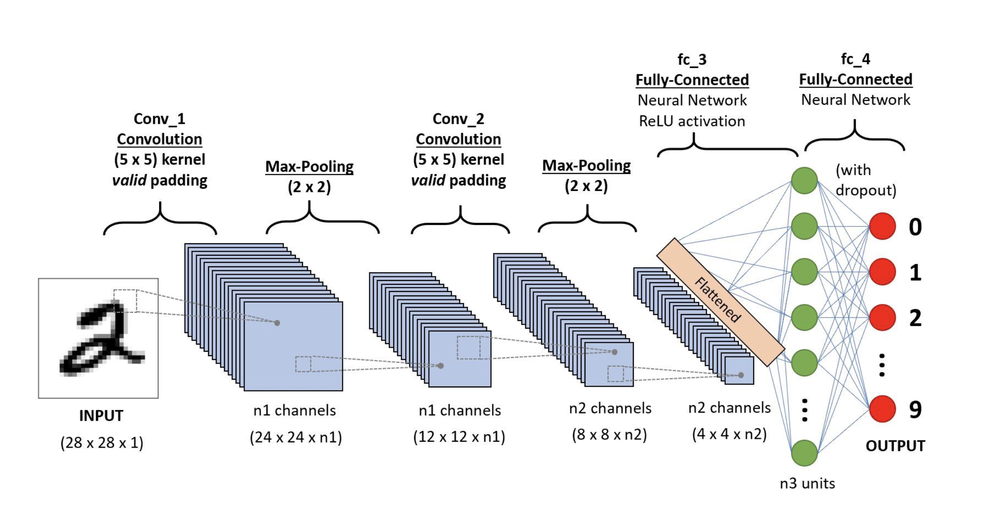

<style>
body {
text-align: justify}
</style>

```{r, echo = FALSE, out.width = '50%', fig.align="center"}

```

# 1. What you will do in this R Notebook

## 1. Introduction

This is the second day of your training in R for Machine Learning. You will now enter the wide, wild and exciting field
of Deep Learning! Neural Networks and Deep Learning have revolutionized the performance of many Machine Learning tasks 
in image analysis, video analysi, natural langage processing and many other "traditional" classification, regression or
clustering tasks.

As for the first lab, you will be dealing with a huge amount of variables (genes expression per patient) compared to the
number of patients. You again would like to **provide the clinician with a simple output** that he can use for his patients.

## 1.2 Main steps

In this notebook, you will be guided through TCGA data and images from the MNIST data. From expression data we will try 
to implement a neural network to perform classification tasks while from images we will also implement a (convolutional)
neural network to also perform classification.

Neural networks and machine learning are at the heart of current innovations! To go further, join us for exciting
research projects! 

## 1.3 In practice

The code is provided to you. You will just have to follow the instructions all along the notebook.
Explanations and corrections will be given throughout the notebook for a subset of the questions.

**IMPORTANT**
There are questions in this notebook that you need to answer and code that you need to write by yourself during the lab
or at home. The ones you have to do during the lab are be indicated by a tag "INCLASS WORK", and the ones you have to
after the class are indicated by "HOME WORK". 

# 2. Build your first neural network with Keras.

## 2.1 About Keras.

[Keras](https://keras.io/) is a Python deep learning library designed to help human build and train neural networks of 
many different types. It builds on top of [Tensorflow 2](https://www.tensorflow.org/), an end-to-end open source
platform for machine leanring. The Keras has an R interface through the [Keras R package](https://keras.rstudio.com/)
which will be using in this lab.

The math is pre-computed, and functions are relatively user-friendly: is a high level API. It can use several
lower level back-ends for the math and calculation. Keras and Tensorflow have been develloped by Google
and are open source.

In order to install Keras using the R package, you will need Anaconda and a Python environment with tensorflow 2
installed. If `Anaconda` (or Miniconda) is not installed on your computer, download and install it. Then, run the
following chunk that will create a conda environment named `r_tensorflow` with the libraries required to run Keras.

```{r}
library(keras)
# keras::install_keras(method="conda", envname="r_tensorflow")
use_condaenv(condaenv="r_tensorflow")
```

You can check with the command `conda info --envs` run from a command line interface that an environment named `r_tensorflow` has been created. After running this cell, restart your R studio. In your new session, comment the line `keras::install_keras` and uncomment the line `use_condaenv`. 

For the next steps we will be using some `R` libraries. Load them with the following

```{r, message=FALSE}
library(RColorBrewer)
library(knitr)
```

We will also use some useful functions.

```{r}
getColors <- function(vec, pal="Dark2", alpha=0.7){
  colors <- list()
  palette <- brewer.pal(max(length(unique(vec)),3), pal)
  i <- 1
  for (v in unique(vec)){
    colors[[as.character(v)]] <- adjustcolor(palette[i], alpha)
    i <- i+1
  }
  colors
}

getConfusionMatrix <- function(labelsPredicted, labelsCorrect, labels=NULL){
  if (is.null(labels)){
    labels <- sort(unique(union(labelsPredicted, labelsCorrect)))
  } else {
    labels <- sort(unique(labels))
  }
  confMat <- data.frame(row.names=labels)

  for (labelPredicted in labels){
    for (labelCorrect in labels){
      confMat[labelPredicted, labelCorrect] <- sum(labelsPredicted==labelPredicted & labelsCorrect==labelCorrect)
    }
  }

  confMat
}
```

## 2.2 Load the data

As in the previous lab, we will be using data from the TCGA project. More specifically we will continue to load
expression data restricted to genes from the Cancer Gene Census.

```{r}
source("../../lib/LoadcBioportal.R")
```

```{r}
CgcTable <- read.csv("../data/CancerGeneCensusCOSMIC_20210120.csv")
CgcGenes <- CgcTable$Gene.Symbol

TcgaData <- LoadcBioportal(Organ="luad|lusc",
                           Genes=CgcGenes,
                           ClinicNeeded=T,
                           MutNeeded=F,
                           RNANeeded=T,
                           NormalizeRNA=T,
                           FunctionalAnnot=F)

print(table(TcgaData$CLINIC$study))
colorsStudy <- getColors(TcgaData$CLINIC$study, alpha=0.7)

TcgaData$CLINIC$study_num <- ifelse(TcgaData$CLINIC$study=="luad",0, 1)
```

## 2.3. Visualize your data

As already explained in the previous lab, it is an important step than visualizing your data and performing some vanilla
analyses. Let us reproduce the same plots as for the `luad|gbm` comparison.

**The distribution plot**

```{r}
hist(x=as.matrix(TcgaData$EXP[TcgaData$CLINIC$study=="luad",]), col=colorsStudy[["luad"]],
     main="Distribution of gene expressions", xlab="Normalized counts", freq = F)
hist(as.matrix(TcgaData$EXP[TcgaData$CLINIC$study=="lusc",]), add=T, col=colorsStudy[["lusc"]], freq = F)
legend("topright",legend=c("luad","lusc"), fill=2:3, cex=0.8)
```

**The heatmap plot**

```{r, fig.cap="TCGA expression data LUAD and LUSC", fig.height=8, fig.width=8, fig.align="center"}
rowNames <- rownames(TcgaData$EXP)
rowStudy <- TcgaData$CLINIC[rowNames, "study"]
rowSideColors <- sapply(rowStudy, function(x) colorsStudy[[x]])
heatmap(as.matrix(TcgaData$EXP), Rowv=NULL, Colv=NULL, keep.dendro=F, RowSideColors=rowSideColors)
```

**The PCA plot**

```{r}
X <- t(t(TcgaData$EXP) - rowMeans(t(TcgaData$EXP)))
resSVD <- svd(X, nu=2, nv=2)
# the scores are the principal components i.e the 
# low-dimensional representations of the samples
scores <- resSVD$u %*% diag(resSVD$d[1:2])
```

```{r,fig.cap="PCA TCGA expression data LUAD and LUSC", fig.height=6, fig.width=6, fig.align="center"}
# plot the two first principal components
plot(scores[,1],scores[,2],
     col=unlist(colorsStudy[TcgaData$CLINIC$study]), 
     pch=16,main='PCA representation',
     xlab=paste("dim1 = ",100*round(resSVD$d[1]^2/sum(resSVD$d^2),3),"%",sep = ""),
     ylab=paste("dim2 = ",100*round(resSVD$d[2]^2/sum(resSVD$d^2),3),"%",sep = ""))
legend("bottomright",legend=c("luad","lusc"), pch=16, cex=0.8, col=2:3)
```


## 2.4 Build a neural network

### Train/test split

For the purpose of assessing correctly the generalization capabilities of our future model we split the data into a
train and a test part.

```{r}
studySize <- nrow(TcgaData$CLINIC)
trainProp <- 0.8
trainIndex <- sample(seq(studySize), size=round(studySize*trainProp))
testIndex <-seq(studySize)[!seq(studySize) %in% trainIndex]

print(paste("Training size:", length(trainIndex)))
print(paste("Test size:", length(testIndex)))
```

### Model building

Building the neural network means building individual layers and connecting them through different methods. Once your
have build your network, you can compile and then fit it on the data.

The basic building block of a neural network is the **layer**. Layers sequentially learn representations of the data fed
into them and outputs their new representation to the following layer until the last layer tha provides a representation
suitable for performing a given tasks.

**INCLASS WORK**  Define a neural network by defining a sequence of dense layers. For this first exercice, you have
build a network with only one hidden layer. The input layer should take as input a vector of size the number of genes
in the `TcgaData$EXP` table while the output layer should produce a 2D vector of "class conditional probabilities"
(neural networks outputs are not in general probabilities). 

*Hint*: In order to build your first model you will need the following functions
1. `keras_model_sequential` to initialize the model object.
2. `layer_dense` to create dense layers (i.e fully connected).

You may find information in the [online documentation](https://cran.r-project.org/web/packages/keras/keras.pdf) of the R
keras package.

```{r}
#### YOUR WORK HERE
```

### Compile the model

Before the model is ready for training, it needs a few more settings. These are added during the model's compilation 
step. In particular, you need to specify the following

1. **The loss function** - This measures how accurate the model is during training. We want to minimize this function to
   "steer" the model in the right direction. Careful designing of the loss function allows to train networks with
   specific properties (regularized for instance).

2. **Optimizer** - This is the numerical methods used to update the network's weights so as to minimize the loss
   function. 

3. **Metrics** - Used to monitor the training and testing steps. The following example uses accuracy, the fraction of
   the samples that are correctly classified.


**INCLASS WORK**  Apply the compilation step on your model by specifying the parameters mentioned above. You should use
`adam` as an optimizer, `binary_crossentropy` as a loss function and `accuracy` as a metric.

*Hint*: Look into [this example](https://tensorflow.rstudio.com/guide/keras/) and into the documentation of the
`compile` function.

```{r}
#### YOUR WORK HERE
```

### Train your network

In order to train your neural network, you will have to provide it with the training data (predictive variables and
predicted variable) as well as extra parameters specifiying the `validation_split` for assessing the model performance
during the training, the number of `epochs` or the batch size.

1) What are epochs? What is the batch size? What could be the advantage of reducing or increasing the batch size?

**ANSWER**:

&nbsp;

**INCLASS WORK** Use the `fit` method to train your neural network on training data. Train it on 50 epochs using a
validation split of 20%.

```{r}
#### YOUR CODE HERE
```

As the model trains, the loss and accuracy metrics are displayed. This model reaches an accuracy of about XX on the training data.

## Evaluate accuracy
Next, compare how the model performs on the test dataset:

**INCLASS WORK** Use the `evaluate` method to evaluate the quality of your neural network on test data. How does it
compare to the train accuracy? The validation accuracy? Use the `predict_classes` method to compute the confusion
matrices on the train and test sets.

```{r}
#### YOUR WORK HERE
```

**INCLASS WORK** Experiment with other architectures by adding more layers, changing the layer sizes and/or adding
regularization methods like `dropout` or `batch normalization`. Read about these online or in the documentation.

```{r}
#### YOUR WORK HERE
```

# 3. Build your first CNN

Convolutional neural networks are a specific type of neural networks that use a reduced number of parameters compared
to conventional feed-forward neural network by exploiting the local structure that exists in the input data. These
networks are particularly performan on images which are highly structured data.

In this exercice you will be training a Convolutional neural network on the now famous [MNIST data set](
http://yann.lecun.com/exdb/mnist/).

## 3.1 Load the MNIST data

```{r load.data}
mnist   <- keras::dataset_mnist()
x_train <- mnist$train$x          # 3d array (60000,28,28)
y_train <- mnist$train$y          # 1d array (60000)
x_test  <- mnist$test$x           # 3d array (10000,28,28)
y_test  <- mnist$test$y           # 1d array (60000)

colorsDigit <- getColors(y_train, pal="Paired")
```

## 3.2 Visualize some examples

As usual, let's have a look at the data

```{r, fig.width=4, fig.height=4, fig.cap="36 Images from MNIST", fig.align="center"}
par(mfcol=c(6,6))
par(mar=c(0, 0, 0, 0), xaxs='i', yaxs='i')
for (idx in 1:36) { 
    im <- x_train[idx,,]
    im <- t(apply(im, 2, rev)) 
    image(1:28, 1:28, 1-im, ann=F, xaxt="n", yaxt="n", col=gray((0:255)/255), main=NULL)
}
```

For the needs of the model and the next step, the following chunk reshapes the data into matrices by flattening the
28x28 images into 756-long vectors and one-hot encoding the observation labels.

```{r}
x_train <- keras::array_reshape(x_train, c(nrow(x_train), 784))
x_test  <- keras::array_reshape(x_test, c(nrow(x_test), 784))
x_train <- x_train/255
x_test  <- x_test/255
y_train_cat <- keras::to_categorical(y_train, 10)
y_test_cat  <- keras::to_categorical(y_test, 10)
```

To begin with, let's go for a naive strategy and run a PCA analysis on the input training samples to see how they
cluster.

**INCLASS WORK** Reuse the code you already saw in order to run a PCA on the MNIST data set and see how the digits
clusters in the first 4 principal components.

```{r}
#### YOUR WORK HERE
```

```{r,fig.cap="PCA MNIST digits", fig.height=6, fig.width=12, fig.align="center"}
par(mfcol=c(1,2))

plot(scores[,1],scores[,2],
     col=unlist(colorsDigit[as.character(y_train)]), 
     pch=16,main='PCA representation',
     xlab=paste("dim1 = ",100*round(resSVD$d[1]^2/sum(resSVD$d^2),3),"%",sep = ""),
     ylab=paste("dim2 = ",100*round(resSVD$d[2]^2/sum(resSVD$d^2),3),"%",sep = ""))
legend("bottomright",legend=names(colorsDigit), pch=16, cex=0.8, col=unlist(colorsDigit))

plot(scores[,3],scores[,4],
     col=unlist(colorsDigit[as.character(y_train)]), 
     pch=16,main='PCA representation',
     xlab=paste("dim3 = ",100*round(resSVD$d[3]^2/sum(resSVD$d^2),3),"%",sep = ""),
     ylab=paste("dim4 = ",100*round(resSVD$d[4]^2/sum(resSVD$d^2),3),"%",sep = ""))
legend("bottomright",legend=names(colorsDigit), pch=16, cex=0.8, col=unlist(colorsDigit))
```

## 3.3 Build your "traditional model"

**INCLASS WORK** Build first a "traditional" neural network, compile and train it the MNIST data set.

```{r}
#### YOUR WORK HERE
```

A very nice way to visualize the evolution of the network accuracy is through the learning curves which may take
multiple forms. In particular, one type of learning curve is that of plotting the score of your model as it moves
through epoch. You can do this plot very simply by simply applying the `plot` function on the `history` object produced
by the `fit` function from the previous chunk.

```{r,fig.cap="Learning curves", fig.height=6, fig.width=6, fig.align="center"}
plot(history)
```

Assess the performance of your model using the `evaluate` and `predict_classes` function.

```{r eval}
#### get loss and accuracy on the test set
eval_test <- model %>% evaluate(
    x       = x_test,
    y       = y_test_cat,
    verbose = 0
)
print(paste("Loss on test set:", round(eval_test["loss"], 5), sep=" "))
print(paste("Accuracy on test set:", round(eval_test["accuracy"], 5), sep=" "))
```

**INCLASS WORK** Display the confusion matrices.

```{r}
#### YOUR WORK HERE
```

## 3.4 Build your CNN model

```{r, echo = FALSE, out.width = '75%', fig.align="center"}

```

**INCLASS WORK** Build the convolutional neural network displayed in the image above, compile and train it the MNIST
data set. Has your performance improved?

```{r}
#### YOUR WORK HERE
```
